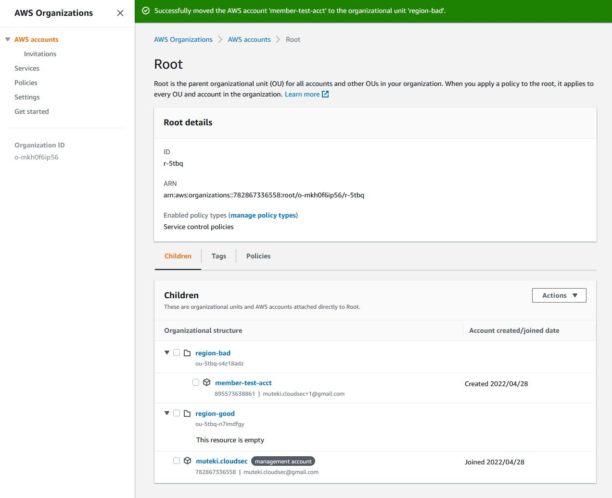

# Holistic AWS Cloud Security Design for Newcomers @ BSides Charm 2022

## Activity One: Setting Up & Securing Your Organization

By the end of this activity, you should have familiarity with the following:

* Creating AWS Accounts and securing root user credentials
* Creating AWS Organizations and using Organizational Units
* Applying Service Control Policies at the OU level
* BONUS: Configuring billing preferences and creating Billing Alarms

### IMPORTANT: I strongly recommend creating entirely new AWS accounts for this exercise. If using existing accounts, please proceed with caution.
New AWS accounts can be created using email aliasing such as YOUR_NAME[+ALIAS]@gmail.com

## Part A: Create and secure a new AWS Account

1. Create new AWS account
***NOTE: This will be the Organization management account! I do not recommend using any existing AWS accounts for this training.***
* [Create a new account on the AWS website](https://aws.amazon.com/console/).
* Account type should be personal.
* You'll need to enter personal and credit card information, but this training will attempt to keep services within the Free Tier.

2. Secure root user with MFA ([AWS Documentation](https://docs.aws.amazon.com/IAM/latest/UserGuide/id_credentials_mfa_enable_virtual.html#enable-virt-mfa-for-root))
* Log into account and go to "Security Credentials" under the dropdown in the top righthand side
* Configure your chosen MFA method

3. Set billing preferences
* Navigate to the Billing service by searching or selecting under "Services" in the top left. 
* Click on "Billing Preferences" and select "Receive Free Tier Usage Alerts" and "Receive Billing Alerts"

## Part B: Create an Organization, OUs, and onboard a new member AWS account

4. Create Organization
* Navigate to AWS Organizations and select "create Organization"
* **Note:** The account you're currently logged into will become the Organization's management account!

5. Create a member account
* In the AWS Accounts view in Organizations, select "Add an AWS Account"
* Create new account called `member-test-acct`, using your email address with alias such as "YOUR_EMAIL+TEST1@gmail.com". IAM role name can be left as default.
* This process may take 5+ minutes, so we'll come back to this shortly.

6. Create new Organizational Units
* In the AWS Accounts view in Organizations, select the Root OU
* Under the Actions dropdown, select Organization Unit -> Create New
* Create 2 new OUs: `region-good`, `region-bad`

## Part C: Creating Service Control Policies

7. Create two Service Control Policies 
* Navigate to Organizations -> Policies -> Service Control Policies 
* In Service Control Policies, create a new policy called `region-good`. Copy and paste the text of [region-good SCP policy here](region-good.json) into the policy statement policy statement box, replacing the placeholder text.
* Next, create a new policy following the same process, named `region-bad`. Copy and paste the [region-bad SCP policy here](region-bad.json).

8. Apply SCPs to OUs
* Returning to AWS Accounts, click on the `region-good` OU. Locate the 'policies' tab, and click 'attach' to select and apply the `region-good` SCP.
* Follow the same process for the `region-bad` OU, attaching the `region-bad` policy.

9. Move member account into OU
* In AWS Accounts view, move `member-test-acct` into the OU `region-bad`
* Your OU structure should look like this:

10. Configure member account
* New account `member-test-acct` should now have been created.
* Log into the new account (use a private browsing window for simplicity!) using the aliased email
* Set the root user password for `member-test-acct` by selecting "forgot my password"
* NOTE: In the real world, we would want to secure this account with MFA immediately, but in the interests of time we'll leave it as is.

11. Test the SCP with S3
* In `member-test-acct`, navigate to the Amazon S3 service page and select "Create Bucket"
* Name the bucket `bsidescharm2022awstrainingbucket-[and some randomness of your choosing]`
* NOTE: S3 buckets names are unique globally, so two buckets in different accounts cannot have the same name.
* Select the AWS Region `us-east-1`
* Leaving everything else as default, hit "Create Bucket"

***The bucket creation should fail!***

Briefly review the contents of the SCP [region-bad SCP policy here](region-bad.json) to determine why the creation failed.

12. Move member account between OUs
* In AWS Accounts, move `member-test-acct` into the `region-good` OU
* Repeat the bucket creation steps above.

*** This creation should succeed ***

Review the contents of the SCP [region-good SCP policy here](region-good.json) to determine why this creation succeeded.

### You're done!

### BONUS: Configure Billing Alarms

[AWS Guide: Configure Billing Alarms](https://docs.aws.amazon.com/AmazonCloudWatch/latest/monitoring/monitor_estimated_charges_with_cloudwatch.html)

13. Configure custom alarms for billing thresholds with CloudWatch. 
* Note that Billing Alerts must be enabled beforehand!
* Navigate to the AWS CloudWatch Service -> Alarms -> Billing
* Select "Create Alarm" and hit "Select Metric"
* Select "Billing" -> "Total Estimated Charge"
* Select the "USD" option and then hit "Select metric"
* On the next page, you can configure the condition under which the alert fires, ie. setting a static threshold for a projected cost over $5
* Next, configure actions associated with the alarm.
* Under "in alarm", select "Create new topic" and give it a name, then select "Create topic". 
    * An Amazon SNS topic is an event stream that is required to send notifications
* Hit "Next", name the alarm, hit next, review and then "Create alarm" to save
* NOTE: To complete this process, you'll need to confirm your subscription to the SNS topic by responding to the subscription confirmation email.

## References:

SCP Source:
https://asecure.cloud/a/scp_whitelist_region/

